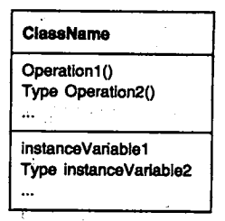
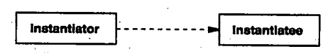
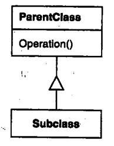
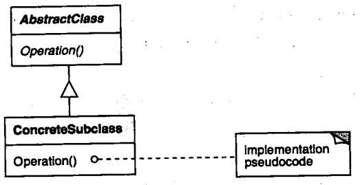
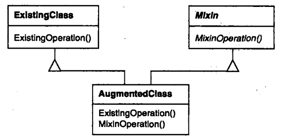
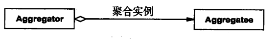

[TOC]

# 定义
**对象建模技术**，是对于事物的属性和方法封装形成对象，从对象和对象间关系的角度文档化系统，是面向对象分析和设计的基础

# 描述对象的实现_专有名词
- **方法/操作**：对象对数据进行操作的过程。对象在收到请求后，会执行相应的操作
> 请求是使对象执行的唯一方法，操作是对象改变**内部数据**的唯一方法
- **封装**：对象的内部状态不能被直接访问，它的表示对于外部是不可见的
- **动态绑定**：发送给对象的 请求和它的相应操作 在运行时刻的连接 
> 给对象发送请求时，所引发的最终操作与两个因素相关：请求、接受对象
- **多态**：动态绑定时允许在运行时替换拥有 相同接口的对象 ，这种可替换性称之为多态
- **型构**：对象声明的每一个操作指定 **操作名**、**作为参数的对象**和**返回值**
- **接口**：对象操作所定义的所有操作型构的集合被称为该对象的接口
> 接口描述了该对象所能接受的全部请求的集合，任何匹配对象接口中型构的请求都可以发送给该对象
- **类型**：是用于标识特定接口的名称
> 如果一个对象可以处理'windows'接口的所有操作请求，那么就说该对下该对象具有'window'类型，一个对象可以有很多个类型，并且不同的对象可以共享同一个类型。 
> 对象接口的某部分可以用某个类型来刻画，而其他部分则可以用其他类型来刻画。
- **子类型**：当一个类型A的接口包含另一个类型B的接口时，就可以称类型B是类型A的子类型
- **超类型**：情形同上，可以称类型A是类型B的超类型
- **类**：类指定了对象的内部数据和表示，也定义了对象所能完成的操作
- **实例化**：对象通过实例化类创建
- **实例**：通过某类实例化创建的对象被称为某类的实例
- **类继承**:新的类可以通过类继承来定义，新定义的类被称为**子类**，被继承的类称为**父类**。子类包含父级的所有数据和操作，并且可以定义自己的数据和操作，子类可以改进和重定义父级的操作。
- **抽象类**：主要作用是为子类定义公共接口。将部分或全部操作延迟到子类
> 注意，不要将抽象类实例化
- **抽象操作**：在抽象类中定义却没有实现的操作
- **具体类**：非抽象类
- **重定义**：子类改进和重新定义父类操作的行为
- **混入类**：给其他类提供可供选择的接口或功能的类，与抽象类一样不能实例化
> 注意：混入类要求实现多继承【JS原生不支持多继承】
- **聚合**：一个对象包含另一个对象，聚合意味着对象需要对象另一个对象赋值
- **引用/关联/相识**：相识意味着一个对象仅仅知道另一个对象，相识的对象可以请求彼此的操作，它们不必为彼此负责。
> 相识是一种比聚合弱的关系，它只标识了对象间较松散的耦合关系

# 从UML图形式判断关系/名称
- **矩形**：类
- **矩形层_黑体**：类名
- **矩形层_常规字**：数据【属性】
- **矩形层_常规字**：操作【方法】
> 注意：类名、数据、操作之间用实线分隔
- **斜体字**：抽象【类/操作】
- **常规字**：具体【类/操作】
- **虚线箭头**：类实例化对象【箭头指向实例对象】
- **实现箭头**：引用【相识/关联】关系
- **菱尾实线箭头**: 聚合关系
- **三角竖线**：子类继承父类【三角箭头指向父类】
- **折角框**：具体实现【代码】
- **小圆圈虚线**：连接操作方法与具体实现/伪代码【小圆圈位于操作方法】

# 实例图分析
分析待补充...
- 
- 
- 
- 
- 
- 

