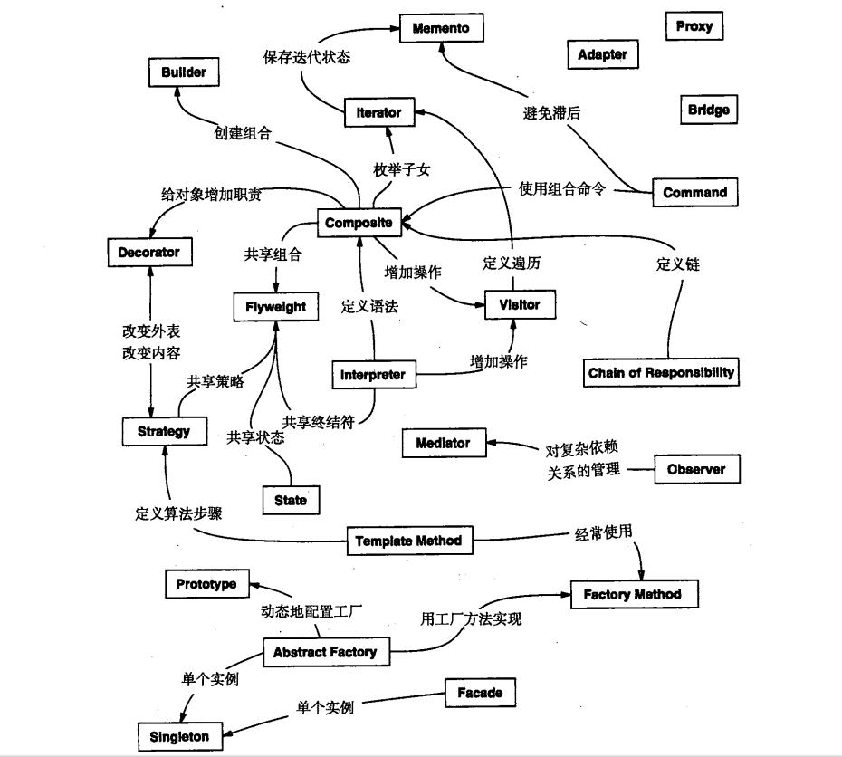

[TOC]

# 根据目的
## 创建型
> 创建型模式与对象的创建相关

## 结构型
> 结构型模式处理类或对象的组合

## 行为型
> 行为型模式对类或对象怎样交互和怎样分配职责进行描述

# 根据范围
## 类范围
> 类模式处理类和子类之间的关系，这些关系是通过继承建立，是静态的。从某种意义上来说几乎所有模式都是用继承机制，所以**类模式**只指集中于处理类间关系的模式，大部分模式属于对象模式

## 对象范围
> 对象模式处理对象间的关系，这些关系在运行时刻是可以变化的，更具动态性

# 对象关系图
